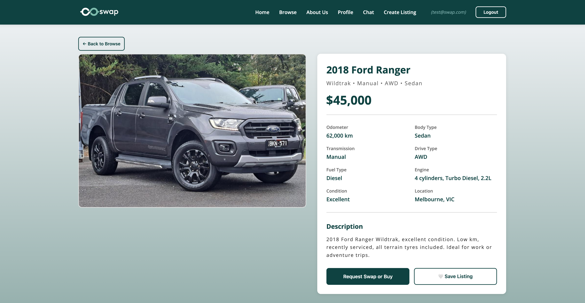
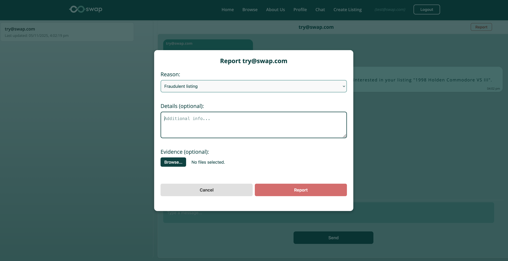
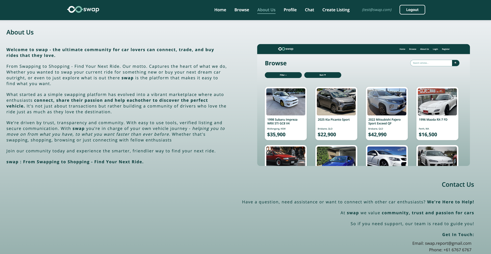

# Swap - Application Screenshots

This folder contains screenshots demonstrating the key features and user interface of the Swap vehicle marketplace platform.

---

## Authentication & Landing

### Home Page

**Description:** Landing page featuring a scrolling carousel of featured vechile listings, along with a start browsing button, and a navigation bar to register, login, browse or a about us section. 

### Registration Page

**Description:** User registration form with email/password fields and validation. New users create an account to access full platform features such as making requests, swaps and chatting.

### Login Page

**Description:** User login interface for existing members.

---

## Browse & Search

### Browse Marketplace

**Description:** Main marketplace view displaying all available vehicle listings in a grid layout. Each listing card shows the primary image, make/model, year, price, and location. Users can click any listing to view full details.

### Filter System

**Description:** Dynamic filtering system allowing users to narrow listings by make, model, year range, price range, condition, fuel type, and transmission. Filter options are generated dynamically from the database.

### Filtered Results

**Description:** Browse page showing filtered results after user applies multiple criteria. Demonstrates how the filter system narrows down listings to match user preferences.

---

## Listing Management

### Create Listing Page

**Description:** Comprehensive form for creating new vehicle listings. Includes structured inputs for all specifications (make, model, year, odometer, drivetrain, engine, badge, transmission, fuel type, condition, location, price, description).

### Image Upload

**Description:** Multi-image upload interface integrated with Cloudinary. Users can upload multiple photos, preview them, and drag-and-drop to reorder images.

### Listing Detail Page

**Description:** Full listing view displaying all vehicle specifications, image gallery, seller information, and action buttons (Make Offer, Message Seller, Add to Wishlist). This is the page users see when clicking on any listing card.

### Edit Listing

**Description:** Edit form pre-populated with existing listing data. Users can modify any field, update images, or delete the listing entirely.

---

## Profile & Dashboard

### My Listings Tab

**Description:** User dashboard with tabbed interface providing access to four main sections: My Listings, Received Request, Sent Requests, and Wishlist. View of all user's active listings with options to view or delete each listing, and the status of the listing.

### Requests Received Tab

**Description:** Incoming offers on user's listings. Displays offer type (buy/swap), amount or swap vehicle, and action buttons to accept or decline each offer.

### Requests Sent Tab

**Description:** Outgoing offers the user has made on other listings. Shows offer status (pending/accepted/declined) and links to the target listings.

### Wishlist Tab

**Description:** Saved listings the user has bookmarked for future reference. Users can quickly access saved listings or remove items from their wishlist.

---

## Offers & Swaps

### Swap Request Modal - Buy Offer

**Description:** Modal allowing users to make a cash purchase offer on a listing.

### Swap Request Modal - Swap Offer

**Description:** Modal for proposing a vehicle exchange. User selects one of their own listings to offer in trade. Shows both the target listing and the proposed swap vehicle.

### Offer Received Notification

**Description:** Real-time notification when a user receives a new offer on one of their listings.

### Accept Offer Confirmation

**Description:** Confirmation dialog when accepting an offer. Shows offer details and confirms the user's decision before finalizing.

---

## Communication

### Chat Page

**Description:** Messaging interface with split view showing conversation list on the left and active chat on the right. Messaging between buyers and sellers. List of all user conversations showing last message preview, timestamp, and unread indicators.

### Message Thread

**Description:** Full conversation view with message bubbles, timestamps, and message composition area at the bottom.

---

## Notifications

### Notification Badge

**Description:** Navigation bar showing notification bell icon with unread count badge. Alerts users to new messages, offers, and status updates.

---

## Safety & Moderation

### Report Modal

**Description:** Modal for reporting suspicious users or fraudulent listings. Includes reason dropdown and description text area. Reports are sent to admin review.

### About Us Page

**Description:** Informational page about the Swap platform, team members, mission statement, and contact information.
